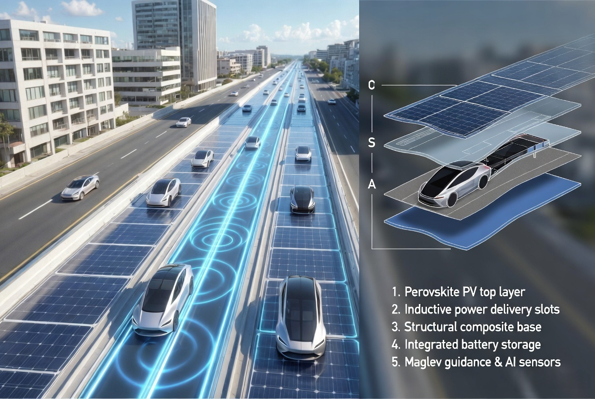
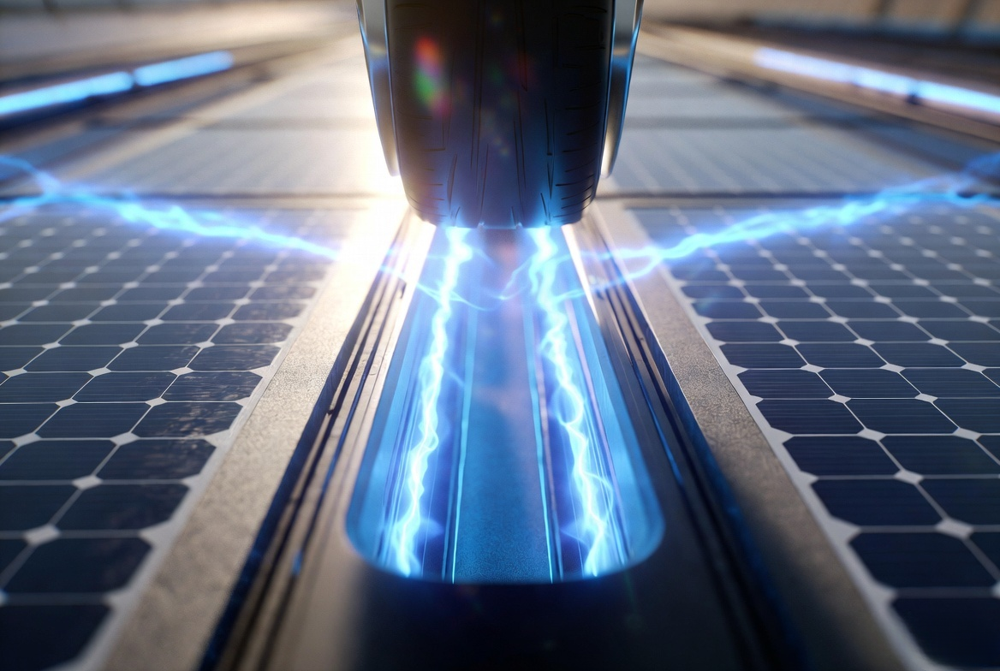
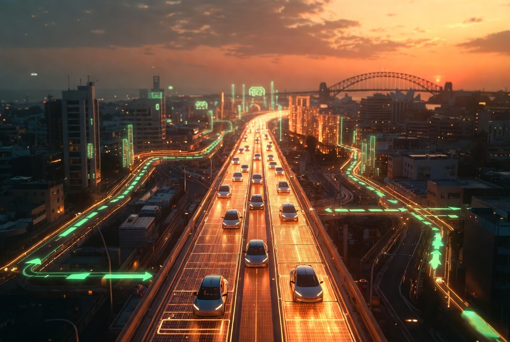
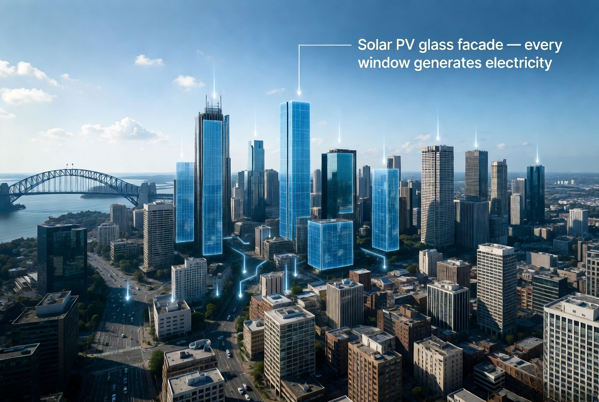
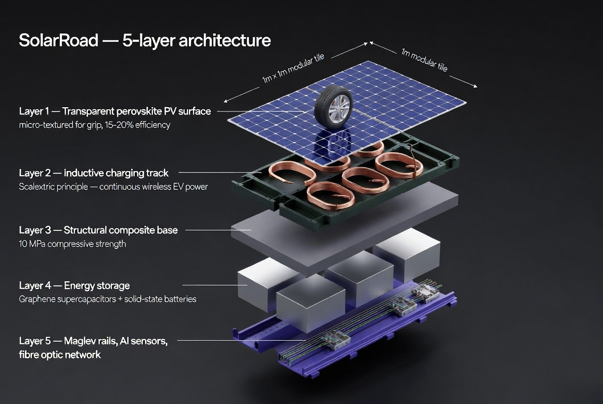
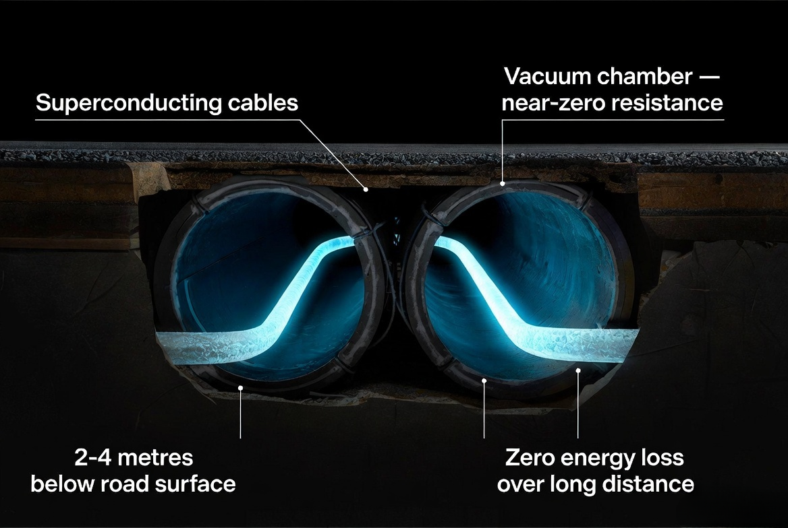
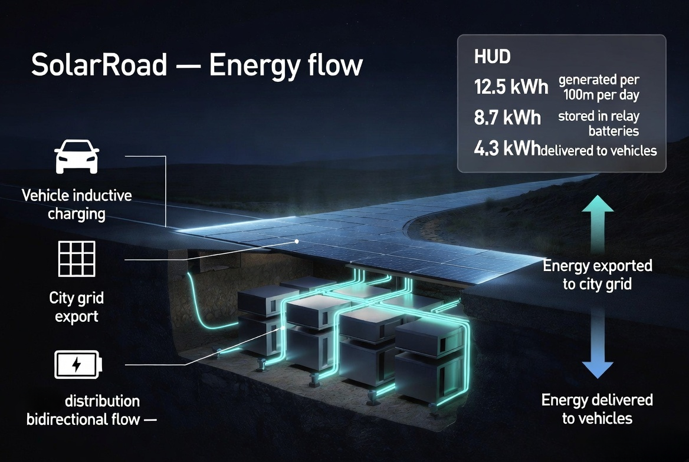
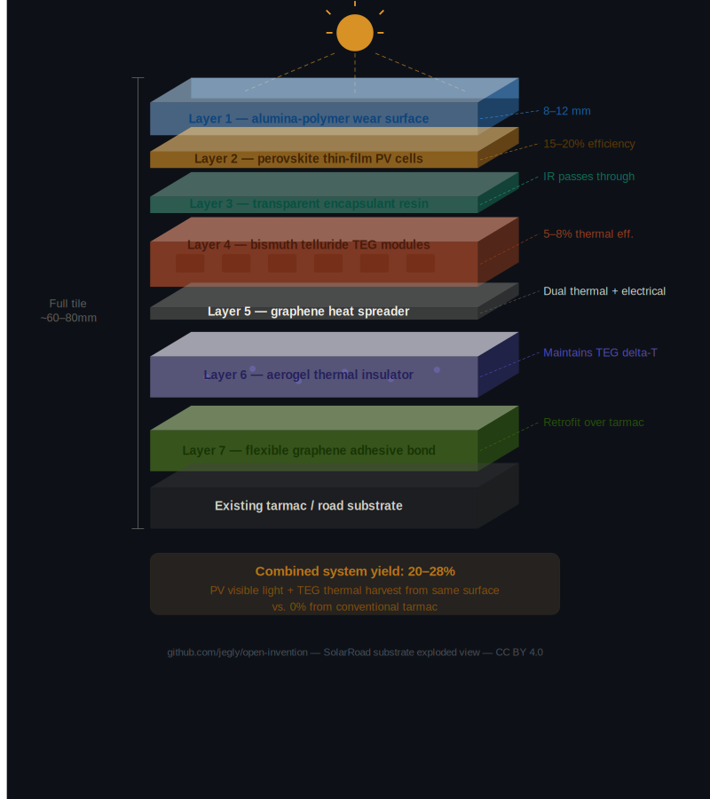

# ⚡ SolarRoad

> *"What if every road was a power station, every building a solar panel, and every car ran on the city itself?"*

**SolarRoad** is an open invention proposal for a fully integrated, self-powered road and urban energy ecosystem. Inspired by the simplicity of Scalextric — toy cars powered by an electric circuit track — this project proposes applying that same principle at civilisation scale: roads that power the vehicles travelling on them, harvest solar and thermal energy, guide autonomous transport, and eliminate fossil fuel dependency entirely.

No petrol. No emissions. No traffic jams. No road deaths.

---

---

## The Core Idea

A child's Scalextric set is a perfect proof of concept. The car needs no engine, no fuel tank, no exhaust — it draws power continuously from the track it runs on. Scale that principle to real roads, combine it with solar collection, superconducting transmission, AI traffic management, and next-generation energy storage, and you have a civilisation-level energy and transport solution that eliminates petrol from the equation entirely.

Every road surface becomes a solar collector. Every building window becomes a power generator. Every vehicle draws power from the road itself. Underground superconducting cables carry that energy with near-zero loss. AI manages the entire network in real time.

This is not science fiction. Every component technology exists today. The innovation is in integration, materials engineering, and the will to deploy.

---

## The Case for Acting Now

Petrol is finite. That fact alone makes this transition inevitable — the only question is whether we do it proactively or wait until we are forced to. The long-term benefits to the planet, to human health, and to future generations vastly outweigh the initial investment cost. The rollout would be gradual — exactly as 4G was replaced by 5G, as gas lighting gave way to electric — road by road, city by city, country by country.

The initial cost is real. So is the cost of doing nothing.

Transport accounts for **24% of global CO₂ emissions — approximately 8 billion tonnes per year.** Australia alone produces ~100 million tonnes of transport CO₂ annually. Globally, **1.35 million people die on roads every year** and a further 50 million are injured — nearly all preventable with AI-managed autonomous systems.

Continuing to build petrol infrastructure is not pragmatism. It is short-term thinking at civilisational scale.

---

## The Sydney Calculation

To illustrate the energy potential, consider Sydney as a case study.

**Road surface area:** Sydney's metropolitan road network covers approximately 12,000 km of roads. At an average width of 10 metres, that is **120 km² of surface** — all of it currently absorbing sunlight and radiating it back as waste heat.

With transparent solar substrate and Sydney's average of 5.5 peak sun hours per day:

| Source | Daily generation | Annual generation |
|---|---|---|
| Solar road substrate (conservative, 10% efficiency) | 66,000 MWh | 24,090 GWh |
| Solar road substrate (optimistic, 20% efficiency) | 132,000 MWh | 48,180 GWh |
| Solar building glass (50,000 buildings, 8% efficiency) | 11,000 MWh | 4,015 GWh |
| Thermal harvesting — TEG road modules (5% efficiency) | 26,400 MWh | 9,636 GWh |
| **Total (conservative)** | **103,400 MWh** | **37,741 GWh** |
| **Total (optimistic)** | **169,400 MWh** | **61,831 GWh** |

Sydney's total annual electricity consumption is approximately **45,000 GWh.**

At conservative technology levels, the SolarRoad system covers **~84% of Sydney's entire electricity demand** — roads and buildings alone, before any other renewable input. At near-future efficiency targets, the system becomes a **net energy exporter at 137% of consumption** — powering homes, industry, and feeding surplus back to the wider grid.

The road network stops being infrastructure that costs public money. It becomes infrastructure that generates it.

---

## System Architecture — Five Layers

### ☀️ Layer 1 — Solar Collection

**Transparent solar road substrate**
The road surface is replaced with a load-bearing transparent resin composite embedded with photovoltaic cells. Vehicles drive on it normally; sunlight passes through and is converted to electricity below. Engineered for high compressive strength, maximum solar transmittance, thermal stability, and self-cleaning surface properties.

**Solar building glass (metropolitan deployment)**
In cities, conventional windows are replaced with transparent photovoltaic panels. Buildings retain full visual transparency while every window generates electricity. Combined with thermal conversion of solar heat absorbed by building facades, the entire built environment becomes a distributed power station. In a city like Sydney, where towers receive direct sunlight across enormous glass facades, the energy yield is substantial — see the Sydney Calculation above.

**Relay energy stations**
Distributed battery hubs along road networks act as local storage and distribution nodes. They buffer energy between collection and demand, ensure no single point of failure, and handle the variable nature of solar input. Built with solid-state graphene batteries or next-generation nuclear batteries for maximum energy density and minimal self-discharge. Relay stations also serve as redundancy nodes — if any section fails, adjacent stations cover demand automatically.

---

### 🛣️ Layer 2 — The Active Road Bed

**Surface: transparent solar resin composite**
The visible driving surface. Transparent enough to pass usable light to the PV layer below, tough enough to handle heavy vehicle loads, textured for grip. Replaces conventional tarmac. See Section 1 for material science detail.

**Inductive power track**
Continuous inductive coils deliver wireless power to vehicles in motion — the Scalextric principle at civilisation scale. Vehicles draw energy continuously while driving. Onboard batteries become emergency backup, not the primary power source. A vehicle never needs to stop to charge. Existing EVs can be retrofitted with receiver coils. Conventional petrol vehicles remain fully functional throughout the transition.

**Maglev rail channels**
For high-speed lanes, magnetic levitation rails embedded in the road bed lift equipped vehicles fractionally from the surface, eliminating tyre-road friction. Higher safe speeds, dramatically reduced tyre wear, lower rolling resistance, improved energy efficiency.

**Thermoelectric generator (TEG) modules**
Road surfaces absorb enormous solar heat. TEG modules convert the temperature differential between hot surface and cooler substrate directly into electricity — energy that would otherwise be radiated as waste heat.

**Road de-icing**
In cold climates, resistive heating elements in the road surface — powered by stored solar energy — keep the surface above freezing. Roads that de-ice themselves. No salt, no grit, no black ice, no weather-related closures.

---

### 🌊 Layer 3 — Road Gutter and Kerb Channel

The gutter becomes a multi-purpose infrastructure conduit running the full length of every road:

- **Fibre optic AI data network** — real-time connectivity between vehicles, sensors, relay stations, and central AI
- **Rainwater harvesting** — passive precipitation collection for urban water supply
- **Road sensor arrays** — continuous monitoring of traffic, structural integrity, temperature, weather, and emergencies. Sensors serve dual purpose: primary monitoring and system redundancy
- **Utility conduit** — power, communications, and thermal management in a single protected channel
- **Pedestrian and cyclist integration** — pavement-side inductive charging strips for e-bikes, e-scooters, and mobility devices; pedestrian safety sensors at junctions

---

### 🔋 Layer 4 — Underground Superconducting Layer

**Superconducting power cables in vacuum chambers**
Conventional cables lose energy as heat through resistance. Superconducting cables at low temperatures have near-zero resistance — energy travels from collection to storage to end-use with minimal loss. Housed in insulated vacuum chambers 2–4 metres beneath the road, forming the zero-loss energy backbone of the network.

**Direct energy storage nodes**
Underground storage at distributed intervals. Design principle: minimise conversion steps — each conversion loses energy. Solar electricity goes directly to electrical storage and is delivered back as electricity. Graphene supercapacitors for fast-response buffering. Solid-state batteries for day-scale storage.

---

### 🤖 Layer 5 — AI Autonomous Vehicle System

**AI central traffic management**
A city-wide AI system manages all vehicle routing in real time. Traffic flow becomes a mathematical optimisation problem — not chaotic emergent behaviour. Traffic lights become unnecessary. Congestion is eliminated by design. In major cities, the efficiency gain alone represents a significant reduction in wasted energy, time, and pollution from idling.

**Emergency vehicle priority**
Ambulances, fire engines, and police receive absolute routing priority. A clear corridor opens ahead of an emergency vehicle in real time across the entire network. Response times improve. Lives are saved directly.

**Zero road deaths**
Human error causes over 90% of road accidents. Remove human error through AI routing, maglev guidance, and vehicle-to-vehicle communication, and road deaths approach zero. Globally, **1.35 million lives per year.** This may be the single most significant humanitarian impact of the entire system.

**Autonomous and driver-assisted vehicles**
Fully autonomous on SolarRoad infrastructure, or driver-assisted with human override at all times. Vehicles can leave the circuit and travel on conventional roads normally. The system is opt-in by design throughout the transition.

**Vehicle-to-grid energy balancing**
Parked vehicles feed surplus battery energy back into the road network and into homes. The entire vehicle fleet becomes a distributed storage grid — a geographically dispersed battery stabilising supply and demand around the clock.

**Noise reduction**
Maglev guidance and smooth composite surfaces eliminate the majority of tyre-road and mechanical noise. Cities become significantly quieter.

---

## Section 1 — Solar Substrate Material Science

The transparent road surface is the most novel and critical component. Everything else — maglev, inductive charging, AI routing, superconductors — exists in deployed forms today. The solar substrate is what makes this genuinely new.

**The core trade-off**
Transparency and solar efficiency pull against each other. Current transparent PV achieves 1–10% efficiency at high transparency (>60% visible light transmission), versus 20–22% for conventional opaque panels. Closing that gap is the central challenge.

**Road-specific requirements**

| Property | Requirement |
|---|---|
| Compressive strength | ≥ 10 MPa |
| Skid resistance (wet) | Friction coefficient ≥ 0.45 |
| Solar transmittance | ≥ 40% to PV layer |
| Temperature range | −40°C to +85°C without delamination |
| Service life | ≥ 20 years under traffic loading |
| Surface hardness | Vickers hardness ≥ 600 HV |

**Leading PV approaches**

*Perovskite solar cells* — high efficiency potential, rapidly improving stability, manufacturable as thin films. Lab efficiency records now exceed 25%.

*Organic photovoltaics (OPV)* — flexible, lightweight, printable onto substrates. Lower efficiency but highly compatible with resin composite embedding.

*Quantum dot PV* — tuneable absorption spectrum, high efficiency potential at high transparency, early-stage but promising for the specific balance required.

---

## Section 2 — Energy Storage: Technology Comparison

Design principle: **minimise conversion steps, maximise round-trip efficiency, maximise energy density, maximise cycle life.**

### Graphene-based supercapacitors

| Property | Value |
|---|---|
| Round-trip efficiency | ~95–98% |
| Energy density | ~10–30 Wh/kg (rapidly improving) |
| Cycle life | >1,000,000 cycles |
| Charge/discharge speed | Seconds to minutes |
| Self-discharge | Moderate (days to weeks) |

Best for: short-term buffer storage at relay stations, vehicle-to-grid peak balancing, high-frequency charge/discharge applications.

### Solid-state batteries

| Property | Value |
|---|---|
| Round-trip efficiency | ~90–95% |
| Energy density | ~400–500 Wh/kg (projected near-term) |
| Cycle life | ~5,000–10,000 cycles |
| Charge/discharge speed | Minutes to hours |
| Self-discharge | Very low (months to years) |

Best for: long-term strategic storage, relay stations requiring days of stored capacity, vehicle onboard batteries. No liquid electrolyte — no fire risk.

### Nuclear batteries (betavoltaics)

| Property | Value |
|---|---|
| Output type | Low, continuous, ultra-reliable |
| Service life | 10–50 years depending on isotope |
| Self-discharge | None |

Best for: always-on sensor arrays, superconducting vacuum chamber maintenance, AI traffic node backup power.

### Recommended hybrid architecture

| Layer | Technology | Purpose |
|---|---|---|
| Relay stations — fast response | Graphene supercapacitors | Immediate demand buffering |
| Relay stations — day storage | Solid-state batteries | 24-hour supply coverage |
| Infrastructure nodes | Nuclear batteries | Always-on sensor and AI power |
| Grid-scale bulk storage | SMES underground | Large-scale balancing, zero loss |
| Vehicle onboard | Solid-state batteries | Range extension and V2G |

---

## Section 3 — Substrate Material Science: The Full Stack

The substrate is where solar collection, thermal harvesting, structural strength, and electrical generation all have to coexist in a single tile. Getting the material stack right is the engineering heart of the entire system.

### The Core Principle: Harvest the Same Sunlight Twice

Perovskite PV cells capture energy from visible light. Directly beneath them, thermoelectric generator (TEG) modules capture the heat that the PV cells themselves generate. Combined theoretical yield from a single surface: **20–28%** — significantly better than either technology deployed alone.

### The Full Substrate Stack

| Layer | Material | Function |
|---|---|---|
| 1 — Wear surface | Alumina-reinforced polymer (8–12mm) | Load-bearing, transparent, textured for grip |
| 2 — PV layer | Perovskite thin-film cells | Visible light → electricity (15–20%) |
| 3 — Encapsulant | Transparent polymer resin | Protects PV, passes IR heat downward |
| 4 — TEG modules | Bismuth telluride (Bi₂Te₃) | Heat differential → electricity (5–8%) |
| 5 — Heat spreader | Graphene sheet | Even heat distribution + electrical collection |
| 6 — Insulator | Aerogel composite | Maintains TEG temperature differential |
| 7 — Bond layer | Flexible graphene adhesive | Retrofit bond to existing tarmac |

### Combined Efficiency

| Mechanism | Source | Efficiency |
|---|---|---|
| Perovskite PV | Visible light | 15–20% |
| Bismuth telluride TEG | Road surface heat | 5–8% |
| **Combined system** | **Solar + thermal** | **20–28%** |

Conventional tarmac: **0%**

---

## Gradual Rollout

This is a generational infrastructure upgrade — the same category of change as electrifying railways, rolling out the internet, or the transition from analogue to digital. Each of those transitions seemed impossibly large before they happened and inevitable in retrospect.

**Phase 1** — 100m test road segment. Solar composite surface, inductive charging, embedded sensors.

**Phase 2** — 1km urban corridor. Full gutter conduit and underground superconducting backbone.

**Phase 3** — Relay station network at 500m intervals. Day/night storage cycle validated.

**Phase 4** — Autonomous vehicle integration. AI fleet management, maglev guidance, emergency priority routing.

**Phase 5** — Metropolitan pilot. 500m city road plus one high-rise with solar PV glass.

**Phase 6 onwards** — City-by-city, road-by-road expansion. Existing EVs retrofitted. No forced obsolescence.

---

## Impact Summary

| Factor | Current system | SolarRoad |
|---|---|---|
| Road transport CO₂ (global) | ~8 billion tonnes/year | Zero |
| Road deaths (global) | ~1,350,000/year | Approaching zero |
| Road injuries (global) | ~50,000,000/year | Approaching zero |
| Grid transmission loss | 8–15% average | <1% (superconducting) |
| Road surface heat waste | 100% wasted | Harvested via TEG |
| Urban noise pollution | Significant | Dramatically reduced |
| City electricity (Sydney model) | Grid-dependent | 84–137% self-generated |
| Road maintenance | Reactive, frequent | Predictive, extended lifecycle |

---

## Technology Readiness

All component technologies exist. None requires new physics.

| Component | TRL (1–9) | Primary challenge |
|---|---|---|
| Transparent PV road surface | 3–4 | Efficiency + durability under load |
| Inductive road charging (moving vehicles) | 5–6 | Standardisation + cost |
| Embedded maglev (road-scale) | 4–5 | Integration with road formats |
| Superconducting underground grid | 6–7 | Cooling infrastructure cost |
| Solid-state batteries | 6–7 | Manufacturing at scale |
| Graphene supercapacitors | 5–6 | Energy density improvement |
| Autonomous vehicle AI | 7–8 | Regulatory frameworks |
| Transparent PV building glass | 5–6 | Efficiency at high transparency |

*TRL = Technology Readiness Level. 9 = fully deployed commercial technology.*

---

## Licence

Released under **Creative Commons Attribution 4.0 International (CC BY 4.0).**

Share it, build on it, deploy it — credit the source.

**github.com/jegly/open-invention**

---

*"The toy car on the track was always the prototype. The road was always the circuit."*
